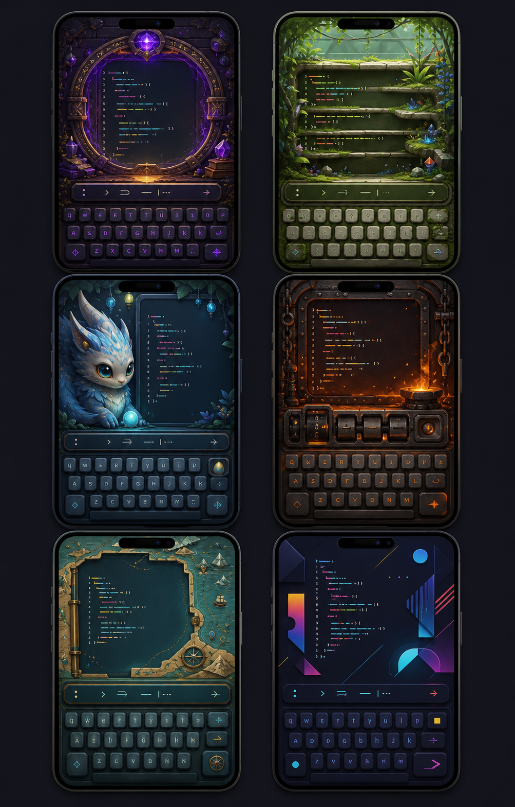
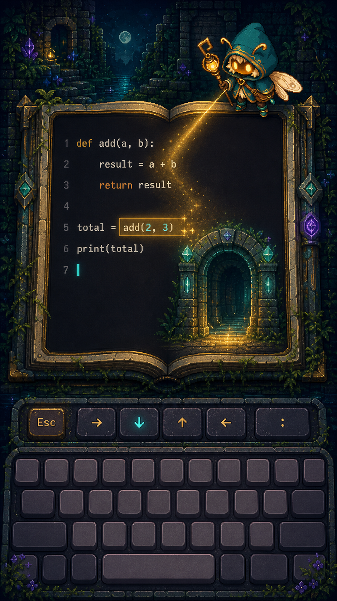
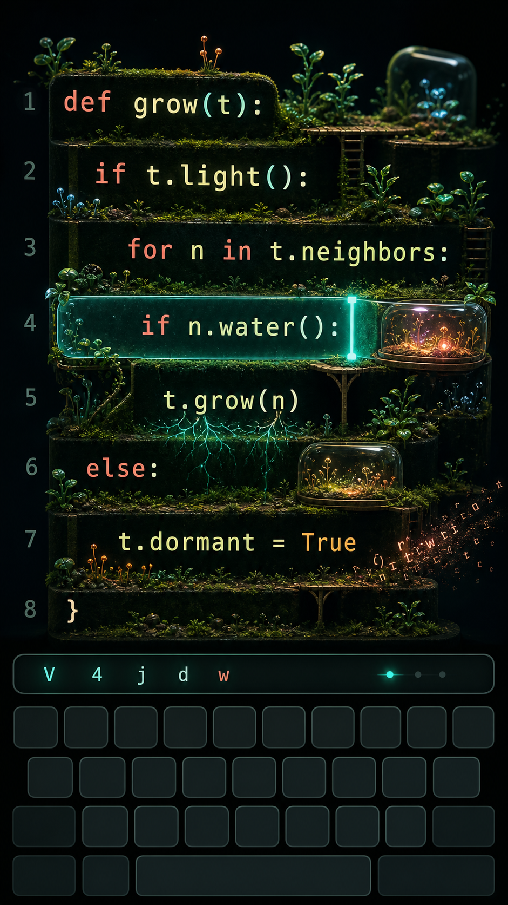
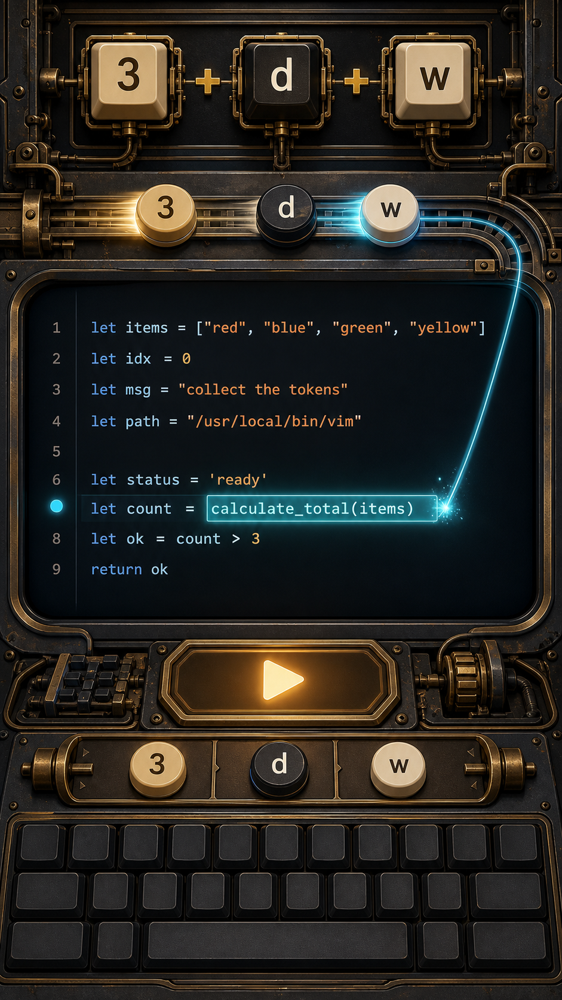
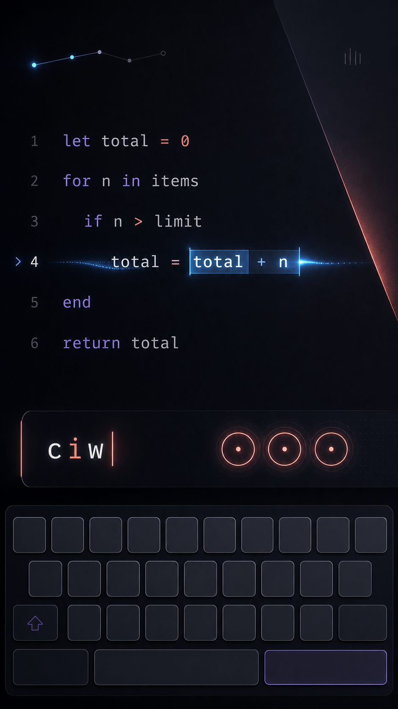

# Visual Design and Gamification

## Purpose

This document explores how Vim Wilds can feel captivating, characterful, and game-like without allowing decoration to compete with the thing the learner came to practice: editing real code.

It is intentionally not a redesign of the current prototype. The prototype proves that three product decisions are valuable:

- A realistic, touchable keyboard can work on a phone.
- A command tray can make invisible Vim state understandable.
- Real code should remain the central exercise material.

Everything else is open. The world need not be a tile board. A gate need not remain behind the editor. Nix need not always be visible. Theory, exercises, success, navigation, and rewards do not need to share one rigid composition.

The curriculum and progression system are specified separately in [curriculum-and-progression.md](./curriculum-and-progression.md). The market and learning context are covered in [claude.md](./claude.md) and [deep-research-chatgpt.md](./deep-research-chatgpt.md). This document concentrates on visual identity, interaction rhythm, gamification, animation, themes, and a realistic art-production system.

## Fixed product constraints

The exploration assumes only these constraints:

- Portrait phones from roughly 360–430 CSS pixels are the primary surface.
- The current physical-style keyboard remains available and visually unchanged.
- Users with a real keyboard may hide the on-screen keyboard.
- The command-and-hint tray remains immediately above the keyboard or its collapsed replacement.
- Actual text remains HTML-rendered, selectable-by-the-engine, high-contrast code.
- Important text and controls remain comfortably readable without zooming.
- An exercise must begin within seconds; a user should never have to navigate a decorative world before practicing.
- The visual system must be achievable by one developer using AI-assisted coding and mostly AI-generated art.
- Core practice remains local and responsive. Decorative media may enhance it but must never become an input-latency dependency.

## The central design question

The wrong question is “what background should sit behind the code?”

The better question is:

> At each timescale—from one keypress to an entire chapter—what should the learner feel, and how much of the screen is available for expressing it?

During an edit, space and attention are scarce. Between edits, the product can briefly become theatrical. At chapter boundaries, it can become fully cinematic. Treating those as separate visual moments is the key to gaining both clarity and spectacle.

## Exploration framework

Each direction is evaluated on:

1. Emotional appeal and distinctiveness.
2. Code readability on a 360px-wide phone.
3. Suitability for exercises.
4. Suitability for theory and demonstration.
5. Animation potential.
6. Scalability to thousands of exercises.
7. Required quantity and consistency of art.
8. Solo-development feasibility.
9. Performance and reduced-motion behavior.
10. Compatibility with multiple themes.

Scores later in the document use a 1–5 scale, where 5 is strongest. For “asset economy” and “solo feasibility,” a high score means less production burden.

## Visual direction atlas



The atlas is deliberately a collection of provocations rather than six skins of one layout. It demonstrates that the editor/keyboard relationship can survive radically different emotional identities.

Generated code and key legends in all concepts are illustrative. Production code, instructions, keyboard geometry, and accessibility semantics must remain real web UI.

---

## Direction 1: Enchanted Portal Theatre



### Premise

The editor is not a slab obscuring a fantasy board. It is the magical object: an open book, restoration altar, observatory window, enchanted mirror, or portal. The world belongs around its silhouette and can occasionally emerge through it.

This keeps the emotional promise of the original enchanted ruins while discarding its composition.

### Exercise state

- Code occupies the pages or aperture of the central artifact.
- The environment appears in a shallow perimeter, visible through cutouts, beyond the frame, and in the artifact’s material.
- Nix may perch on the frame, look through the portal, or briefly enter from outside it.
- The command tray remains a separate, highly legible functional surface.
- Decorative frame thickness reduces automatically on short screens.

### Command-in-progress feedback

- Operator-pending mode makes a rune or frame seam glow, as if the artifact is waiting for a target.
- Counts create restrained beats along the frame.
- Motions move a spark without moving Nix across every character.
- The affected range is highlighted by the real editor; the frame only echoes its color.

### Success transformation

The completed edit becomes a doorway. Light travels from the changed range into the frame, the editor briefly gains depth, and the next scene appears through it. A gate therefore exists as a transition, not as a permanently occluded prop.

### Theory presentation

The artifact becomes a demonstration book. One page shows the command grammar; the other contains live code. Components can move from the margin into the command tray and then affect the code.

### Long-term progression

Each chapter restores a landmark in a larger enchanted world. Reward illustrations reveal places in full detail, while ordinary exercises reuse the chapter’s artifact and frame.

### Asset and implementation requirements

- One artifact frame per chapter or theme.
- Several depth layers for background, frame, foreground, and light.
- A small library of Nix poses and frame interactions.
- Masked CSS layers, sprite animation, and occasional canvas particles.
- No bespoke illustration for individual exercises.

### Strengths

- Memorable identity and immediate emotional appeal.
- Rich success transitions.
- Existing Nix and ruins assets remain useful without dictating layout.
- Supports collectible chapter illustrations naturally.

### Risks

- Ornate frames can steal width from code.
- Maintaining consistent perspective across AI-generated frames takes discipline.
- Nix must not become a constant moving distraction.
- It can feel like a fantasy skin unless the magic reacts meaningfully to Vim state.

---

## Direction 2: Living Code Terrarium



### Premise

Code is the landscape. Indentation creates terraces, blocks create habitats, delimiters anchor bridges, and selections illuminate regions. This direction does not put scenery behind an editor; it visualizes the structure of text as a miniature ecosystem.

### Exercise state

- Lines sit on clean, dark terraces with generous vertical rhythm.
- Botanical material lives between lines and in the margins, never across glyphs.
- Small bridges or roots may emphasize indentation and scope.
- The cursor is a crisp cyan traveling light.
- Glass habitats and plants are decorative echoes of strings, blocks, and repeated structures, not literal syntax parsing requirements.

### Command-in-progress feedback

- Motions send light along a line or between structural anchors.
- Visual selections create a transparent greenhouse pane around the exact selected range.
- Yank captures a few firefly-like motes into the register indicator.
- Delete dissolves material away from the text after the buffer has changed.
- Put regrows or reassembles material where text appears.

### Success transformation

Corrected structure causes a short bloom: roots connect, a dormant lamp wakes, or water reaches the next terrace. The bloom should last under 1.5 seconds and then settle into a quiet state.

### Theory presentation

Terraces are particularly good for explaining:

- Indentation and nested structures.
- Inside versus around text objects.
- Visual Block as a rectangular pane.
- Registers as stored seeds or specimens.
- Repetition as propagation.

The metaphor is less naturally suited to Ex ranges and regex, so those lessons would need a different visualization layer.

### Long-term progression

A personal terrarium becomes more diverse and complex as command families are integrated. Maintenance review keeps established biomes alive rather than implying completed knowledge is permanently finished.

### Asset and implementation requirements

- Reusable edge, terrace, plant, light, root, glass, and particle assets.
- A layout engine that anchors decoration to line boxes without altering text metrics.
- Careful clipping and `pointer-events: none` for every decorative layer.
- Strong automated tests for occlusion and contrast.

### Strengths

- The most original concept in the exploration.
- Connects feedback directly to edited text.
- Beautiful even without a character.
- Naturally supports nature, circuit, deep-sea, and cosmic variations.

### Risks

- The hardest direction to keep readable.
- Responsive anchoring around variable code is more complex than a framed editor.
- Too much literal mapping between syntax and scenery would become fragile.
- Reduced-motion and low-power modes would remove much of its differentiator.

### Verdict

Use its interaction ideas—cursor light, selection pane, register motes, restrained growth—in the shared reactive layer. Do not make the entire first product depend on a fully structural terrarium renderer.

---

## Direction 3: Pocket Familiar

### Premise

The editor remains clean while an expressive companion supplies emotion, guidance, anticipation, and celebration. This is closest to the character-led engagement model used by successful learning products, but it should retain the quieter intelligence appropriate for a developer tool.

Nix can serve this role, but the system should permit other familiars or a no-character setting.

### Exercise state

Several compositions are viable:

- **Peek:** a small familiar looks over the editor frame.
- **Bench:** the familiar occupies a short stage above the editor.
- **Margin:** the familiar lives in a side gutter when width permits.
- **Dormant:** the familiar shrinks to a small portrait during focused or advanced work.

The companion never overlaps active code and never loops a large animation while the user is deciding.

### Command-in-progress feedback

- Eyes follow the cursor region, not every character.
- Operator-pending produces an attentive pose.
- A correct command produces a small approving motion.
- Hesitation may produce a glance toward the hint control, but not an unsolicited answer.
- Incorrect input triggers curiosity or encouragement, never mockery.

### Success transformation

The familiar performs a short action that is semantically connected to the chapter: unlocking, planting, forging, charting, or repairing. A small number of high-quality animations can serve hundreds of lessons.

### Theory presentation

The familiar can point, demonstrate, and provide one short sentence per card. It must not become a talking head covering long tutorial copy. Theory still uses live code and animated ranges.

### Long-term progression

- A shared home or camp changes over time.
- Accessories represent chapter accomplishments.
- New idle poses and reactions are collected.
- Relationships with several original companions may unlock.
- Users can disable, minimize, or replace the companion.

### Asset and implementation requirements

- One character reference sheet.
- Six core poses: idle, attentive, explain, uncertain, celebrate, rest.
- Three to five reusable short sprite animations.
- Expression variants and optional accessories.
- A strict art bible for silhouette, proportions, palette, and lighting.

### Strengths

- High emotional value per asset.
- Excellent code readability.
- Reactions can be shared across every curriculum topic.
- Character customization provides rewards without changing exercise logic.

### Risks

- A weakly animated character feels cheaper than a beautiful still illustration.
- Repetition becomes irritating if the reaction vocabulary is too small.
- Excessive cuteness could alienate users seeking a serious practice tool.

### Verdict

Make Nix an important default layer, but allow “quiet,” “minimal,” and alternate-familiar settings. Character presence should decrease as task complexity and code density increase.

---

## Direction 4: Command Forge



### Premise

Vim is a language for constructing transformations. Counts, operators, motions, registers, and text objects become components assembled into a tool, spell, or machine. Unlike decorative fantasy, the metaphor directly teaches the product’s central idea.

### Exercise state

- The live editor remains the largest region.
- A compact assembly rail shows only the command entered so far.
- Components are large while theory is active and collapse into the existing tray during practice.
- The current mode changes the material or tension of the assembly mechanism.

### Command-in-progress feedback

For `3dw`:

1. `3` sets capacity and creates three restrained charge marks.
2. `d` selects the delete mechanism and enters operator-pending mode.
3. `w` attaches the motion target.
4. The assembled tool previews the affected range.
5. Execution transforms the real buffer.

The animation must take tens or hundreds of milliseconds, not force the learner to wait for a machine.

### Success transformation

The assembled mechanism produces something useful: a repaired key, a charged lantern, a map component, or a new automation module. Advanced lessons can visually upgrade from hand tools to repeat engines, macro cylinders, substitution lenses, and global selectors.

### Theory presentation

This is the strongest direction for:

- Count + operator + motion.
- Inside versus around.
- Register + operation.
- Macro record and replay.
- Range + Ex command.
- Pattern + replacement + flags.
- Deciding between repeat, macro, substitution, and `:global`.

Theory can be interactive without becoming a multiple-choice quiz: learners physically assemble a command and immediately watch it affect real code.

### Long-term progression

A workshop grows from simple tools into a precise automation laboratory. Progress represents greater expressive power, which aligns well with the advanced curriculum.

### Asset and implementation requirements

- Component tokens and a small number of rails, sockets, lenses, and state effects.
- Mostly CSS-driven transforms.
- A semantic mapping from command families to visual materials.
- An alternate non-mechanical skin so pedagogy is not tied to one art style.

### Strengths

- Excellent pedagogical alignment.
- Scales across beginner and advanced Vim.
- Provides satisfying feedback without large environments.
- Component assets are highly reusable.

### Risks

- The detailed workshop aesthetic can become visually heavy.
- It can imply that commands must be entered through chips rather than the keyboard.
- Showing the same command in the forge, tray, and keyboard would be redundant.

### Verdict

Use the assembly grammar for theory and first introductions. Collapse it into a restrained command-tray animation during normal exercises.

---

## Direction 5: Expedition Atlas

### Premise

Practice screens stay calm. Spectacle appears between exercises, where there is no code-reading conflict. Each short edit advances a journey, restores a route, or discovers a location.

### Exercise state

- The exercise may use the cleanest editor composition in the product.
- A tiny destination mark or environmental material connects it to the active chapter.
- No persistent map needs to remain visible during input.

### Command-in-progress feedback

Feedback remains functional: keyboard, tray, cursor, affected range, subtle sound, and optional companion. The atlas does not animate for every key.

### Success transformation

After validation, the editor folds, zooms, or dissolves into a short map view. One path segment lights, a landmark changes, or the party moves one meaningful step. The next exercise opens immediately from that location.

Users who prefer speed can reduce the atlas reveal to a 300ms edge transition or skip it entirely.

### Theory presentation

Chapter introductions use map landmarks as reasons to learn a capability, but the theory itself remains code-first. For example, the “Hall of Mirrors” can introduce repeat, while the explanation uses real code.

### Long-term progression

- Chapters are regions with visible restoration.
- Circular review revisits regions through changing weather, time, or maintenance events.
- Focus lists can appear as user-placed waypoints.
- Mastery does not imply an empty finished map; advanced routes and recurring challenges remain.

### Asset and implementation requirements

- One map illustration per major chapter or world.
- A small collection of landmark state overlays.
- A path renderer and transition choreography.
- No per-exercise backgrounds.

### Strengths

- Maximum code readability.
- Excellent scalability.
- Rich art appears where it can be appreciated.
- Easy to make optional or abbreviated.

### Risks

- Moment-to-moment exercises can feel like an ordinary trainer if their reactive layer is weak.
- Frequent map cuts may slow a one-minute practice session.
- A static map loses value after the first completion unless it visibly supports review.

### Verdict

Use the atlas as the main session and chapter layer, with frequency controlled by session length and user preference.

---

## Direction 6: Kinetic Syntax



### Premise

Illustration is optional. Typography, timing, light, geometry, sound, and haptics can create premium game feel while preserving the seriousness of a developer tool.

### Exercise state

- A spacious editor dominates.
- The cursor and current mode determine a restrained light system.
- The command tray becomes a precise instrument display.
- A tiny constellation, route, or sequence of points represents current progress.

### Command-in-progress feedback

- Counts produce rhythmic pulses.
- Operator-pending introduces subtle color tension at the frame.
- A motion sends a quick trace from source to destination.
- A completed operator sends a wave through the exact affected range.
- Dot-repeat echoes the prior transformation’s motion signature.

### Success transformation

Geometry resolves into alignment, the affected range emits a controlled wave, and the progress constellation gains a point. There is no confetti. The effect communicates precision and fluency.

### Theory presentation

Command grammar appears as large editorial typography and animated range diagrams. This is excellent for experienced users and for abstract concepts such as ranges, captures, and repeated structure.

### Long-term progression

Users unlock palettes, editor materials, cursor trails, soundscapes, and motion signatures. Rewards remain aesthetic rather than collectible characters.

### Asset and implementation requirements

- Very little raster art.
- Strong typography, spacing, color tokens, and animation direction.
- CSS, SVG, Web Animations, and optional small audio samples.
- Careful performance timing and easing.

### Strengths

- Best readability and accessibility.
- Scales almost without limit.
- Ideal reduced-distraction mode.
- Lowest asset burden.

### Risks

- Harder to market from a still screenshot.
- Emotional attachment may be lower.
- Motion quality must be excellent; generic glows will feel like a dashboard rather than a game.

### Verdict

Ship this as both a complete theme and the fallback grammar underneath every illustrated theme.

---

## Direction 7: Dream worlds and borrowable metaphors

These are not commitments to build ten packs. They demonstrate how one semantic system can support broad personalization.

| World | Core metaphor | Strongest curriculum connection | Reusable visual reward |
| --- | --- | --- | --- |
| Botanical Syntax Garden | Edits restore growth and healthy structure | Text objects, indentation, repeat | New species and blooming regions |
| Living Keyboard City | Keys are districts and commands power transit | Keyboard geography, counts, modes | Restored routes and switch towers |
| Deep-sea Archive | Light reveals and reorganizes submerged knowledge | Search, registers, navigation history | New archive chambers and creatures |
| Cosmic Observatory | Motions chart paths; repeats form constellations | Search, jumps, marks, dot-repeat | Completed constellations |
| Cozy Wizard’s Study | Commands repair books, instruments, and recipes | Beginner foundations and theory | Shelves, tools, familiar accessories |
| Origami Code World | Operators fold and transform clean paper structures | Text objects, line operations, formatting | Intricate models and paper landscapes |
| Neon Data Temple | Precise transformations align energy systems | Visual Block, substitution, `:normal` | Activated circuits and chambers |
| Clockwork Library | Registers store volumes; macros operate mechanisms | Registers, macros, automation | Machines and indexed collections |
| Punctuation Creatures | Tiny creatures inhabit delimiters and quotes | Character finds and text objects | Bestiary entries and habitats |
| Reality Restoration | Malformed code distorts space until corrected | Capstones and mixed review | Stable restored scenes |

The best packs do more than recolor assets. Each emphasizes a curriculum metaphor while preserving the same focus, feedback, accessibility, and timing contracts.

---

## Scored comparison

| Direction | Emotional appeal | Code clarity | Theory fit | Exercise scalability | Asset economy | Solo feasibility | Accessibility | Total / 35 |
| --- | ---: | ---: | ---: | ---: | ---: | ---: | ---: | ---: |
| Enchanted Portal Theatre | 5 | 4 | 4 | 4 | 3 | 4 | 3 | 27 |
| Living Code Terrarium | 5 | 3 | 4 | 3 | 2 | 2 | 2 | 21 |
| Pocket Familiar | 5 | 5 | 4 | 5 | 4 | 4 | 4 | 31 |
| Command Forge | 4 | 4 | 5 | 4 | 3 | 3 | 4 | 27 |
| Expedition Atlas | 4 | 5 | 3 | 5 | 4 | 4 | 5 | 30 |
| Kinetic Syntax | 3 | 5 | 4 | 5 | 5 | 4 | 5 | 31 |

The scores explain why no single direction should own every screen. Pocket Familiar and Kinetic Syntax tie for the strongest core exercise system for opposite reasons. Expedition Atlas creates long-term context. Portal Theatre supplies brand imagery and chapter drama. Command Forge supplies the best teaching metaphor. Terrarium contributes memorable reactive effects.

## Recommendation: the Layered Anthology

The recommended product is not a permanent board. It is a set of presentation layers that can be combined differently by screen, theme, learner preference, and device height.

### 1. Focus layer

Always dependable:

- Real code.
- Cursor, selection, and mode.
- Command/hint tray.
- On-screen or physical keyboard state.
- Target and essential progress.

It must remain fully usable with every other layer disabled.

### 2. Reactive layer

Fast, restrained responses tied to real editing:

- Key acceptance.
- Motion trace.
- Operator-pending tension.
- Affected-range wave.
- Register capture/put feedback.
- Error and reset feedback.

This layer borrows most from Kinetic Syntax and Living Code Terrarium.

### 3. Companion layer

Optional emotion and explanation:

- Nix or another familiar.
- Short context-aware poses.
- One-sentence theory comments.
- Celebration and encouragement.
- Customization rewards.

It becomes smaller or disappears during dense advanced exercises.

### 4. Transformation layer

A 0.8–1.8 second completion event that may temporarily own the editor region:

- The edited range sends energy into a landmark.
- The editor becomes a portal.
- A miniature ecosystem blooms.
- A mechanism completes.
- Abstract geometry resolves.

Because the exercise is already validated, this layer can be visually ambitious without hiding required information.

### 5. Journey layer

Session and chapter context:

- Expedition map.
- Restored home or workshop.
- Region state.
- Focus waypoints.
- Review and maintenance events.

This layer appears between exercises, at session boundaries, or on explicit navigation—not behind every edit.

### 6. Reward layer

Rare, high-value moments:

- Chapter illustrations.
- New companion animation or accessory.
- Theme palettes and soundscapes.
- Collectible postcards or field notes.
- Optional short cinematics.

The original `enchanted-ruins.png` belongs here as a precedent: beautiful artwork should feel earned and memorable rather than disposable.

## Recommended default identity

The default product identity should be **Nix’s Living Expedition**:

- **Pocket Familiar** supplies the emotional center.
- **Expedition Atlas** supplies progression and long-term world restoration.
- **Portal Theatre** supplies chapter art and success transitions.
- **Command Forge** supplies theory visualization.
- **Kinetic Syntax** supplies the always-available focus and reduced-distraction system.
- **Terrarium effects** appear selectively in nature-oriented chapters.

This is a stronger default than either “fantasy board behind code” or “minimal editor with badges.” It can look magical in marketing and milestones while remaining fast and readable during actual practice.

## Screen system

The percentages below refer to the space remaining after browser safe areas, not to the full device pixels.

### Exercise layout A: Focus

Best for mixed review, advanced lessons, free practice, and small-height devices.

```text
┌──────────────────────────────────┐
│ compact objective · progress     │  5–8%
├──────────────────────────────────┤
│                                  │
│          REAL CODE               │
│       cursor + selection         │  50–58%
│                                  │
├──────────────────────────────────┤
│ command / hint tray              │  7–9%
├──────────────────────────────────┤
│                                  │
│      EXISTING KEYBOARD           │  29–36%
│                                  │
└──────────────────────────────────┘
```

The reactive layer appears inside margins and behind selections. Companion and scenery are absent or reduced to a small portrait.

### Exercise layout B: Companion stage

Best for foundations and ordinary curriculum lessons.

```text
┌──────────────────────────────────┐
│ objective · progress             │
├──────────────────────────────────┤
│ short Nix/world reaction stage   │  10–16%
├──────────────────────────────────┤
│                                  │
│          REAL CODE               │  40–48%
│                                  │
├──────────────────────────────────┤
│ command / hint tray              │
├──────────────────────────────────┤
│      EXISTING KEYBOARD           │
└──────────────────────────────────┘
```

The stage may collapse as code grows. Nix can peek over the editor edge, but no body part overlaps text.

### Exercise layout C: Artifact

Best for flagship lessons and themed chapters.

```text
┌──────────────────────────────────┐
│ world visible around thin frame  │
│ ┌──────────────────────────────┐ │
│ │                              │ │
│ │     CODE AS BOOK / PORTAL    │ │
│ │                              │ │
│ └──────────────────────────────┘ │
├──────────────────────────────────┤
│ command / hint tray              │
├──────────────────────────────────┤
│      EXISTING KEYBOARD           │
└──────────────────────────────────┘
```

The artifact frame must use outside space and transparent cutouts. It cannot reduce code below the minimum readable size.

### Theory: Field Notes plus live demonstration

Theory should not be a modal filled with prose.

```text
┌──────────────────────────────────┐
│ 1 of 4 · close                   │
├──────────────────────────────────┤
│ one-sentence idea                │
│                                  │
│     LARGE COMMAND GRAMMAR        │
│        3  +  d  +  w             │
│                                  │
│     live code demonstration      │
│     with affected-range preview  │
├──────────────────────────────────┤
│ Back                 Show me     │
└──────────────────────────────────┘
```

Recommended theory sequence:

1. **Purpose:** name the editing intention in one sentence.
2. **Grammar:** assemble the command visually.
3. **Demonstration:** animate cursor, mode, and affected range on real code.
4. **Contrast:** show one useful distinction, such as inside versus around.
5. **Try:** restore the keyboard and perform one real edit.

Three panels are sufficient for simple commands; five is a hard normal maximum. Longer explanation belongs in Reference.

### Success takeover

```text
┌──────────────────────────────────┐
│ completed code remains visible   │
│          ↓ energy                │
│  landmark / portal / geometry    │
│       transforms briefly         │
│                                  │
│  Efficient · 4 keys · Continue   │
└──────────────────────────────────┘
```

The takeover:

- Begins only after validation.
- Is normally 0.8–1.8 seconds.
- Can be tapped to finish immediately.
- Never delays undo or retry after an alternate valid solution.
- Has a reduced-motion form using a color change and state crossfade.

### Physical-keyboard layout

When the virtual keyboard is hidden, do not merely stretch the old board.

Use the reclaimed space for:

- Larger code and more context.
- A richer live diff or before/after comparison.
- A small command history.
- An optional companion or world stage.
- Advanced Ex-command input.
- A compact key-position reminder that can be dismissed.

The command tray stays near the bottom so the eye still has one predictable place for mode, command, and hints.

### Focused practice

- Uses Focus or Companion layout.
- Keeps the selected skill visible.
- Minimizes map interruptions.
- Shows streaks only within the selected drill, not as pressure to stay indefinitely.
- Allows immediate retry and fast regeneration.

### Mixed review

- Uses Focus layout by default.
- Hides the skill label until after an answer when recognition is part of the challenge.
- Uses short world transitions only at session checkpoints, not after every item.

### Free practice

- Opens in Focus or Kinetic Syntax.
- No destination, score, or success animation.
- Theme ambience may continue quietly.
- Optional prompts appear in a dismissible layer.
- Reset, regenerate, reference, and recap remain functional controls.

Free practice must feel like ownership of the editor, not a lesson missing its objective.

### Chapter map

- Uses a full-screen illustration or code-rendered map.
- Shows one recommended destination and several visible alternatives.
- Distinguishes first mastery, focused practice, mixed review, and maintenance.
- Uses restoration states rather than a single linear trail of completed circles.
- Lets the user return to the next edit in one tap.

### Theme selection

Show themes as miniature moving materials or world fragments, not as screenshots full of fake UI. Each card states:

- Visual intensity.
- Companion availability.
- Motion level.
- Download size if optional media is involved.
- Whether the pack has sound.

Theme choice changes decoration and emotional metaphor, not command behavior.

### Reward gallery

Collect:

- Chapter art.
- Field-note illustrations.
- Companion poses and accessories.
- Restored landmark states.
- Palettes and soundscapes.

Avoid currencies, loot boxes, random scarcity, or rewards unrelated to learning.

## Motion and feedback

### Four timescales of spectacle

| Timescale | Event | Normal duration | Visual budget |
| --- | --- | ---: | --- |
| Per key | Accepted key or modifier | 60–120ms | Key depression, tray glyph, tiny pulse |
| Per command | Motion or edit resolves | 160–360ms | Cursor trace, affected-range wave, quiet companion response |
| Per exercise | Target state reached | 800–1,800ms | Landmark transformation, portal, bloom, forge action |
| Per chapter | Major mastery or reward | 3–6s, skippable | Full illustration, richer animation, optional cinematic |

Animations should overlap intelligently rather than add their durations serially. A correct `ciw` must still feel immediate.

### Command-state vocabulary

| Vim state | Visual meaning |
| --- | --- |
| Normal | Stable, cool, ready |
| Insert | Warm continuous caret/edge light |
| Operator-pending | Tension or incomplete circuit awaiting a target |
| Visual | Clearly bounded illuminated range |
| Command-line | Focus shifts to the tray; environment quiets |
| Macro recording | Small persistent record pulse, never a giant warning |
| Search | Matches wake across the code; current match remains strongest |
| Error/cancel | Tension releases; tray gently returns to stable state |

Do not depend on color alone. Shape, position, motion, labels, and real cursor/selection rendering carry the semantics.

### Error behavior

Errors should be legible but not punitive:

- One short tray wobble or boundary pulse.
- A concise explanation.
- No loss of streak, health, or collectible.
- No loud buzzer by default.
- Companion reaction is curious or encouraging.
- The learner may retry instantly or inspect the accepted sequence.

### Sound and haptics

Use progressive enhancement:

- Key sounds are off by default or extremely restrained.
- Command resolution can use a soft material sound.
- Success receives one short musical interval, not a long jingle.
- Errors use a muted texture rather than an alarm.
- Haptics, where supported, distinguish modifier latch, invalid key, and success.
- Sound, haptics, companion reactions, and celebrations have separate controls.

No gameplay rule may depend on audio or vibration support.

### Reduced motion

Every event has a non-spatial equivalent:

- Travel becomes a 100–200ms crossfade.
- Bloom becomes a state swap.
- Camera movement becomes a dissolve.
- Companion animation becomes a pose change.
- Particles disappear.
- Progress remains visible without animation.

“Minimal art” and “reduced motion” are separate controls: a user may want fantasy illustration with little motion, or kinetic motion without characters.

## Scalable art system

### Production models

| Model | Scalability | Consistency | Runtime weight | Recommendation |
| --- | --- | --- | --- | --- |
| Unique image for every exercise | Very poor | Variable | High catalog size | Reject except a handful of flagship lessons |
| Generated short clip for every exercise | Very poor | Difficult | Very high | Reject |
| Procedural tiles behind every editor | Good | Good | Low | Useful for maps, not mandatory for practice |
| Reusable layered theme pack | Excellent | Controllable | Moderate | Primary model |
| Code-native kinetic system | Excellent | Excellent | Low | Required common foundation |

### Theme-pack contract

A mature illustrated pack should target roughly 25–40 reusable assets:

- 1 crop-safe ambient backdrop.
- 1 editor material/frame with short-height and full-height variants.
- 1 chapter landmark with dormant, active, complete, and maintenance states.
- 6–10 environmental props.
- 3 foreground or edge overlays.
- 4–6 effect elements such as glow, motes, leaves, sparks, water, or geometry.
- 1 success transformation storyboard or sprite sequence.
- 1 chapter reward illustration.
- 1 palette and typography pairing.
- 4–8 short sound effects plus an optional ambience loop.
- Optional companion accessory and two themed poses.

The theme exposes semantic roles—landmark, capture effect, success effect, ambient edge—not exercise identifiers. One pack can therefore serve thousands of buffers.

### Shared companion library

Before generating many costumes, establish:

- Front, three-quarter, profile, and back references.
- Exact palette and proportion sheet.
- Neutral lighting reference.
- Six core expressions and poses.
- Scale relative to editor and keys.
- Rules for wings, staff, hood, eyes, and silhouette.

Accessories should preserve the base silhouette. A companion’s identity is more valuable than constant novelty.

### Runtime composition

For the first implementation:

- Keep the editor, keyboard, tray, labels, and buttons in HTML/CSS.
- Use CSS custom properties for palette and intensity.
- Use ordinary image layers for backgrounds, frames, and props.
- Use sprite sheets or short animated WebP only for a few character actions.
- Use the Web Animations API or CSS keyframes for semantic state transitions.
- Use one small canvas only when particles materially improve the effect.
- Keep decorative layers non-interactive and clipped.
- Prefer deterministic animation events over AI video during normal practice.

A heavy game engine is not justified until the product proves that it needs complex scene graphs, physics, or large animated maps. None is required by the recommended first slice.

## AI-assisted art production

### Can the GCP credits help?

Yes. Still-image generation is well matched to theme exploration, master scenes, prop sheets, chapter rewards, and character pose development. A £200 credit balance is enough for substantial still-image iteration at current per-image pricing, although usable production assets require multiple attempts and local cleanup.

Video consumes budget much faster because it is priced by generated duration and usually requires more iterations. Use it only after the still-image language and motion storyboard are stable.

### Current Google model recommendation

As of July 2026:

- **Gemini 3.1 Flash Image / Nano Banana 2** is Google’s recommended general-purpose balance of quality, latency, and cost.
- **Gemini 3 Pro Image / Nano Banana Pro** is better suited to master scenes, complex professional assets, and difficult consistency work.
- **Gemini 3.1 Flash Lite Image** can be useful for cheap, high-volume exploration.
- Gemini’s image workflow accepts multiple visual references, which is valuable for keeping characters, objects, and style consistent.
- **Imagen is deprecated and scheduled to shut down on August 17, 2026.** It should not become a new production pipeline.
- **Veo 3.1/Lite** can generate video from text or image prompts, but should be treated as a cinematic and motion-reference tool, not an exercise renderer.

Sources:

- [Gemini image generation and model selection](https://ai.google.dev/gemini-api/docs/image-generation)
- [Gemini 3.1 Flash Image model](https://ai.google.dev/gemini-api/docs/models/gemini-3.1-flash-image)
- [Vertex AI generative-media pricing](https://cloud.google.com/vertex-ai/generative-ai/pricing)
- [Veo video-generation documentation](https://cloud.google.com/vertex-ai/generative-ai/docs/video/generate-videos-from-text)
- [Veo 3.1 Lite announcement](https://cloud.google.com/blog/products/ai-machine-learning/veo-3-1-lite-and-a-new-veo-upscaling-capability-on-vertex-ai)

Recheck model names, lifecycle, quotas, and pricing immediately before automating a large batch.

### Recommended workflow

1. **Write the art bible.** Define palette, materials, perspective, silhouette, lighting, edge treatment, texture, and prohibited motifs.
2. **Generate broad explorations.** Produce genuinely different compositions before selecting a master identity.
3. **Choose one master scene.** Do not average several incompatible generations.
4. **Establish references.** Save the selected character, object, and style anchors.
5. **Generate semantic assets.** Ask for frames, landmarks, props, poses, and effect elements by role.
6. **Remove backgrounds and normalize.** Standardize canvas size, perspective, palette, edge quality, and lighting locally.
7. **Animate with code.** Generate key poses or storyboards, then use transforms, masks, sprites, and particles.
8. **Test at phone size.** An attractive 4K image can become unreadable at 360px.
9. **Curate aggressively.** Keep only assets that belong to the same world.
10. **Version the art bible.** New batches should cite a stable reference package, not an improvised prose prompt.

### What AI should not generate

- Source code or syntax highlighting used by the product.
- Keyboard legends.
- Instructional copy.
- Buttons and accessibility labels.
- Every frame of ordinary UI motion.
- Correct-answer state or exercise logic.
- Unreviewed runtime personalization.

Generated imagery must remain decorative. The application should continue functioning if every generated asset fails to load.

### Personalized themes

Start with curated packs. Runtime-generated personal worlds add:

- Latency.
- Moderation and content-safety obligations.
- Inconsistent composition.
- Cache and storage requirements.
- Offline failures.
- Hard-to-reproduce support bugs.

A safer progression is:

1. Curated themes.
2. Curated palette and companion choices.
3. User-selected combinations of approved assets.
4. Server-generated personal chapter reward art.
5. Only later, fully generated personal packs with approval and caching.

## First production slice

The first slice should prove the layered system with existing assets and a small amount of new art:

1. Implement the Kinetic Syntax reactive foundation for cursor, selection, operator-pending, command resolution, error, and success.
2. Add Nix in three poses: idle, attentive, celebrate.
3. Create one flexible Moonroot artifact frame instead of a tile world behind every exercise.
4. Build one 1.2-second portal success transition.
5. Create a simple three-location expedition interstitial.
6. Use Command Forge assembly for one theory lesson: `count + operator + motion`.
7. Provide Minimal Art and Reduced Motion settings immediately.
8. Test the slice with foundations, Visual Block, substitution, and macros so the design is not optimized only for one-line beginner edits.

This slice requires no second theme, generated video, elaborate map, procedural world, or runtime personalization.

## Expansion roadmap

### Phase 1: visual grammar

- Kinetic feedback system.
- Nix core reactions.
- One artifact layout.
- One theory visualization.
- One lightweight journey transition.
- Accessibility controls.

### Phase 2: coherent world

- Moonroot theme pack.
- Chapter map and restored landmark states.
- Reward gallery.
- Nix customization.
- Focused-practice and free-practice variants.

### Phase 3: breadth

- Quiet/Kinetic theme.
- One radically different illustrated pack, preferably Command Forge or Botanical Terrarium.
- More companion reactions.
- Themed audio.
- Physical-keyboard expanded layout.

### Phase 4: rare spectacle

- Chapter cinematics where they add genuine value.
- Personalized reward illustrations.
- Seasonal or community theme packs.
- More ambitious map and home restoration.

## Anti-patterns

Do not:

- Generate thousands of exercise backgrounds.
- Require a map traversal before a bite-sized lesson.
- Keep a gate visible if that forces it behind the code.
- Shrink code to preserve scenery.
- Put decoration over glyphs, selections, or the cursor.
- Repeat the same celebration after every exercise.
- Make errors feel like loss or punishment.
- Add currencies or collectible systems disconnected from learning.
- Let generated video run behind active code.
- Adopt a heavy game engine merely to animate a few layers.
- Treat AI output as production-ready without normalization and phone-size review.
- Let a theme change the semantics of Vim input.

## Acceptance principles

A successful visual system satisfies all of these:

- A new user can identify the code, cursor, command tray, and keyboard immediately.
- A user can start the next edit within one tap.
- Code remains readable at 360px without zoom.
- Illustrated and minimal themes share the same functional feedback.
- Success feels more alive than ordinary input but never blocks momentum.
- Theory demonstrates effects on real code.
- The companion is emotionally useful and optional.
- A chapter can feel visually distinct without per-exercise art.
- Reduced motion preserves all state information.
- Missing decorative assets never prevent practice.
- The system can plausibly support tens of thousands of generated exercises.

## Concept-image production notes

The five images in this document were generated with the built-in image-generation workflow as visual-direction references:

- **Direction atlas:** six equal phone explorations covering Portal Theatre, Terrarium, Pocket Familiar, Command Forge, Expedition Atlas, and Kinetic Syntax.
- **Portal Theatre:** used the repository’s enchanted ruins, Nix, and world kit as mood, character, and prop references while requesting a new composition.
- **Code Terrarium:** generated independently with botanical terraces anchored around readable code.
- **Command Forge:** generated independently as a tactile theory screen for `3 + d + w`.
- **Kinetic Syntax:** generated independently as an illustration-free, typography-and-light direction.

They are not implementation screenshots. Their most useful information is hierarchy, material, mood, and metaphor. Exact text, code, keyboard legends, and control geometry must come from the real application.
